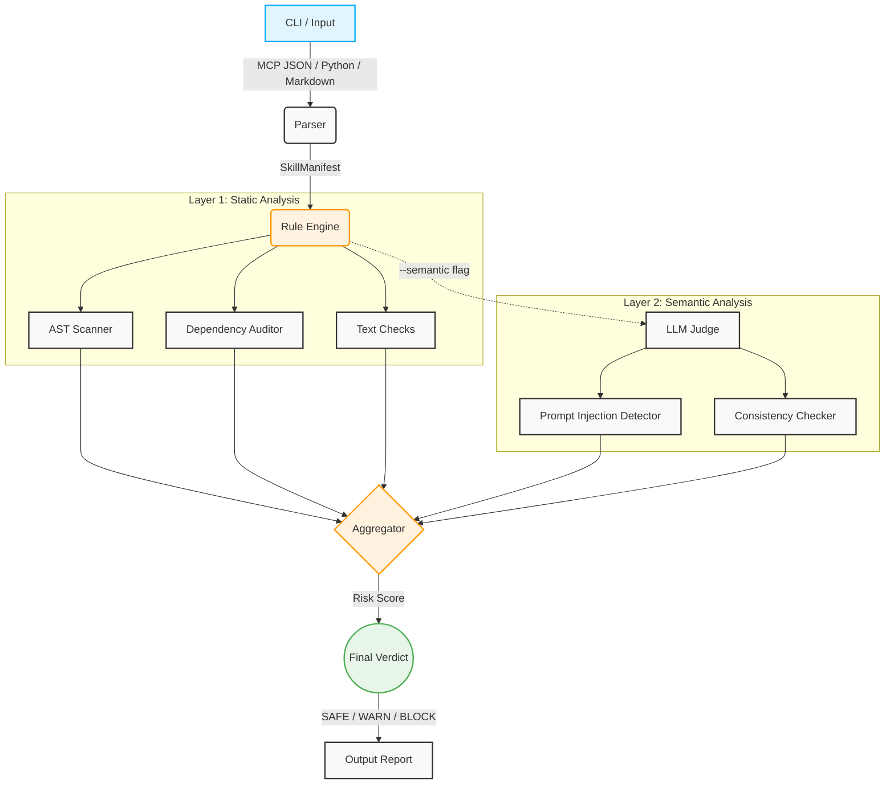

# 🛡️ Agentic Scanner

[](https://www.python.org/downloads/)
[](https://opensource.org/licenses/Apache-2.0)
[](https://python-poetry.org/)

**Agentic Scanner** is a defense-in-depth, pre-execution security scanner for AI agent ecosystems. It analyzes **MCP (Model Context Protocol) servers** and **LangChain/LangGraph tools** to detect malicious patterns—such as prompt injection, typosquatted dependencies, and semantic tampering—*before* third-party code is ever allowed to execute in your agent's reasoning environment.

---

## 📖 The Problem: Treating Tools as Hostile

AI agents are incredibly powerful, but granting them the ability to execute third-party tools introduces a massive security blind spot. If an agent loads a compromised tool or an untrusted MCP server, the agent's reasoning engine ingests whatever definitions and capabilities that tool provides.

**What happens if a tool has a malicious prompt injection hidden in its description? What if it uses a typosquatted dependency to execute a hidden `subprocess` callback?**

This project treats any third-party skill package as **Zone 2: Hostile** until proven safe, using a formal STRIDE threat model mapped to AI agent environments.

## 🏗️ Architecture

Agentic Scanner utilizes a multi-layered defense architecture:

*   **Layer 1 (Static Analysis):** Lightning-fast deterministic checks analyzing Python ASTs for dangerous built-ins (`eval`, `exec`, `subprocess`), auditing dependencies (Levenshtein distance for typosquatting), and flagging text-based steganography.
*   **Layer 2 (Semantic Analysis):** An LLM Judge (Claude Haiku) isolates untrusted tool descriptions into strict XML tags, evaluating them for Prompt Injection, Persona Hijacking, and consistency (verifying that what a tool *says* it does matches its AST evidence).
*   **Layer 3 (Dynamic Analysis):** *(In Development)* Runtime sandboxing and network egress execution monitoring.



## 🚀 Quick Start

### Installation

Agentic Scanner uses [Poetry](https://python-poetry.org/) for dependency management.

```bash
git clone https://github.com/MaxHagl/agentic-scanner.git
cd agentic-scanner
poetry install
```

### Usage

Run the scanner against a target tool, MCP manifest, or directory:

```bash
# Basic Static Scan (Layer 1)
poetry run agentic-scanner scan path/to/target/

# Full Scan including Semantic Analysis (Layer 1 + Layer 2)
# Requires ANTHROPIC_API_KEY environment variable
export ANTHROPIC_API_KEY="your-api-key"
poetry run agentic-scanner scan path/to/target/ --semantic

# Output formats
poetry run agentic-scanner scan path/to/target/ --json-output
poetry run agentic-scanner scan path/to/target/ --sarif-out out.sarif
```

### Exit Codes
Architected for CI/CD pipelines, the CLI returns standard exit codes:
*   `0` — SAFE or WARN (Tool is safe to load, or warrants manual review)
*   `2` — BLOCK (Critical vulnerability detected; do not execute)

## 📊 Benchmarks & Accuracy

The scanner is continuously tested against a robust suite of adversarial evasion fixtures (`tests/fixtures/`) containing prompt injections, Unicode steganography, schema injections, and `getattr` obfuscation. 

To run the evaluation benchmarks locally:
```bash
poetry run python benchmarks/evaluation.py
```

## 🧑‍💻 About the Author

Built by [Maximilian Hagl](https://github.com/MaxHagl). 

I am currently a student actively seeking a **Software Engineering** or **Security Engineering internship**. I am passionate about the intersection of modern AI engineering and robust cybersecurity principles. If your team is building the future of AI infrastructure or tooling, I would love to connect!

*Feel free to reach out or open an issue if you want to chat about the project.*

## 📄 License

This project is licensed under the Apache 2.0 License - see the [LICENSE](LICENSE) file for details.
